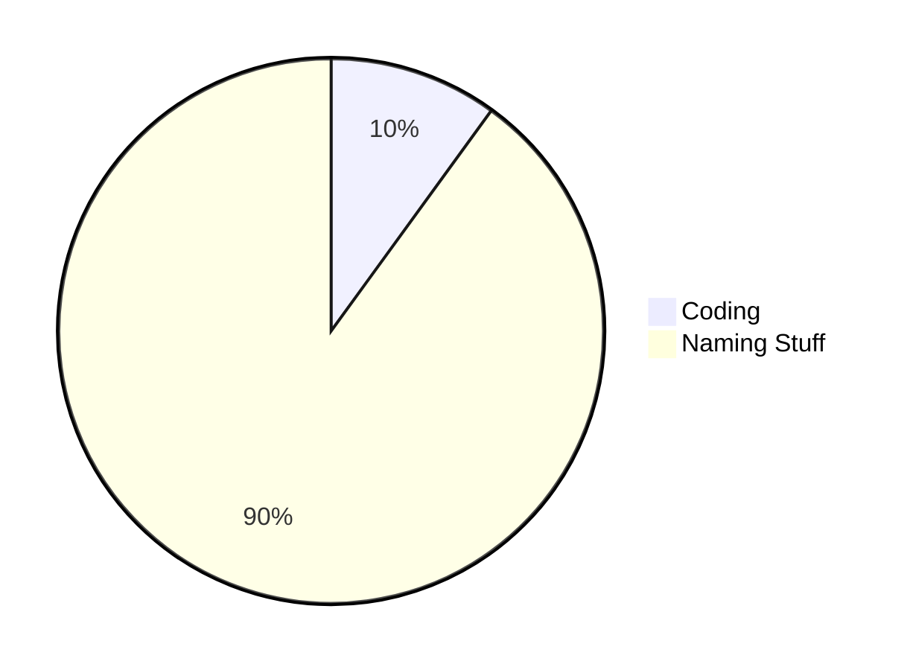

# To Do
Let's see if we can't set up a plan for making this thing truly epic.

## 🧠 Be Moar Smart
- [ ] Make sure you know what your code is doing
- [ ] Metadata
- [ ] Style the app

## 🏅 Best Practices
- [x] Pull requests
- [x] Get branching setup in repo
- [x] Pull Spotify code out into its own file
- [ ] ~~Move secret keys to Actions variable~~ No Need to do this anymore due to new authentication and authorization method
- [ ] Convert JS styling changes to CSS

## 🧹 Clean UP
- [ ] Clean up clutter
- [ ] Remove extra comments
- [x] Get rid of extra token requests
- [ ] Get rid of unused variables
- [ ] Review function/variable names and make sure they make sense

## ♻️ Refactoring
- [ ] Create fewer elements with JS
- [x] Simplify scoring (we don't need to list genres we aren't adding scores to) - maybe we can condense choiceweights and choices together
- [ ] Think about simpler ways to find the highest scoring genre
- [x] Convert genres to an array/object

## 🧘🏻 Stretch Goals
- [x] Add to portfolio
- [ ] Design Logo
- [ ] Add additional types of recommendations (playlists, albums, whatever)
- [ ] Add another API to output data along with the Spotify API
- [x] Allow user to save recommendations

# How Developers Spend Their Time
